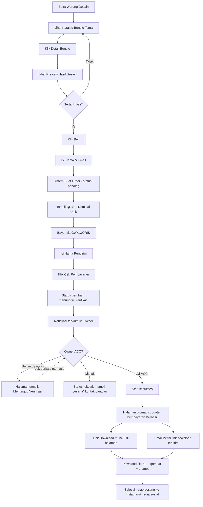
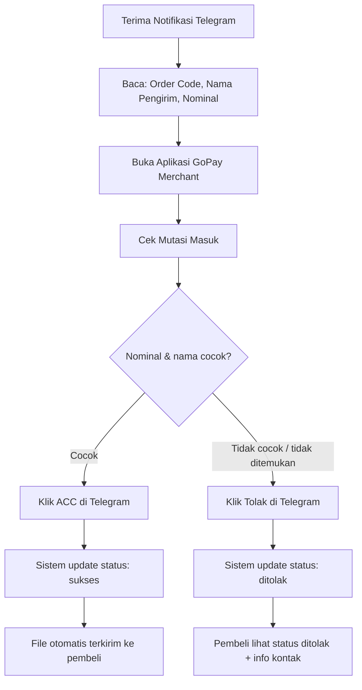
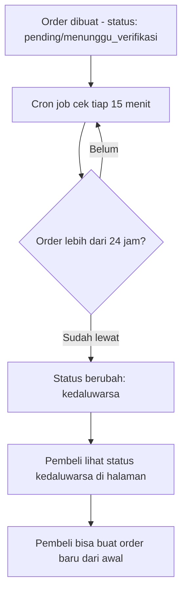

# Alur Penggunaan Aplikasi
## Warung Desain

**Referensi:** PRD v1.0, TDD v1.0
**Tanggal:** 18 September 2026

---

## 1. Alur Pembeli (Admin UMKM)

### Penjelasan Langkah

1. **Buka katalog** — Pembeli membuka Warung Desain, langsung lihat daftar bundle tema tanpa perlu daftar akun.
2. **Lihat detail & preview** — Klik salah satu bundle, lihat contoh hasil desain, deskripsi isi, dan harga.
3. **Checkout** — Klik "Beli", isi nama dan email (untuk pengiriman file nanti).
4. **Bayar** — Sistem tampilkan QRIS GoPay Merchant dengan nominal unik (harga asli + kode unik 3 digit, mis. Rp 49.017).
5. **Konfirmasi** — Setelah transfer, pembeli isi nama pengirim lalu klik **"Cek Pembayaran"**.
6. **Menunggu verifikasi** — Notifikasi otomatis terkirim ke Telegram owner; halaman pembeli menampilkan status "Menunggu Verifikasi" dan update otomatis tanpa refresh.
7. **Hasil** — Begitu owner approve, status berubah jadi "Berhasil", tombol download muncul, dan email otomatis terkirim sebagai cadangan.
8. **Selesai** — Pembeli download file (gambar hasil + prompt teks), siap langsung dipakai posting.

---

## 2. Alur Owner (Verifikasi Pembayaran)

### Penjelasan Langkah

1. **Notifikasi masuk** — Owner menerima pesan Telegram berisi kode order, nama pengirim, dan nominal yang harus dicocokkan.
2. **Cek manual** — Owner buka aplikasi GoPay Merchant, cari mutasi dengan nominal yang sama persis (termasuk 3 digit kode unik di belakang).
3. **Keputusan** — Kalau cocok, klik tombol **ACC** langsung di chat Telegram. Kalau tidak ditemukan/mencurigakan, klik **Tolak**.
4. **Otomatis di sistem** — Begitu diklik, backend langsung update status order dan (kalau ACC) mengirim file ke pembeli tanpa perlu langkah manual tambahan dari owner.

---

## 3. Alur Order Kedaluwarsa (Otomatis)

---

## 4. Ringkasan Status Order

| Status | Kapan Terjadi | Yang Dilihat Pembeli |
|---|---|---|
| `pending` | Order baru dibuat, belum klik "Cek Pembayaran" | QRIS + instruksi bayar |
| `menunggu_verifikasi` | Setelah klik "Cek Pembayaran" | "Menunggu diverifikasi owner" |
| `sukses` | Setelah owner klik ACC | "Berhasil" + tombol download |
| `ditolak` | Setelah owner klik Tolak | "Ditolak" + info kontak bantuan |
| `kedaluwarsa` | Lebih dari 24 jam tanpa verifikasi | "Kedaluwarsa, silakan order ulang" |
