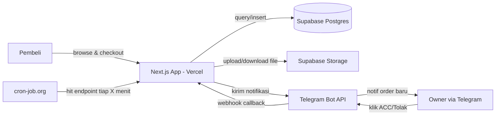
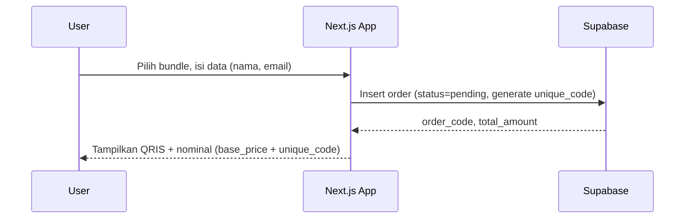
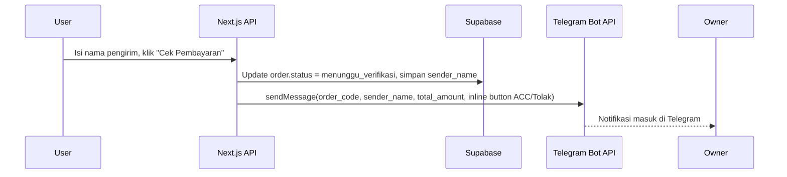
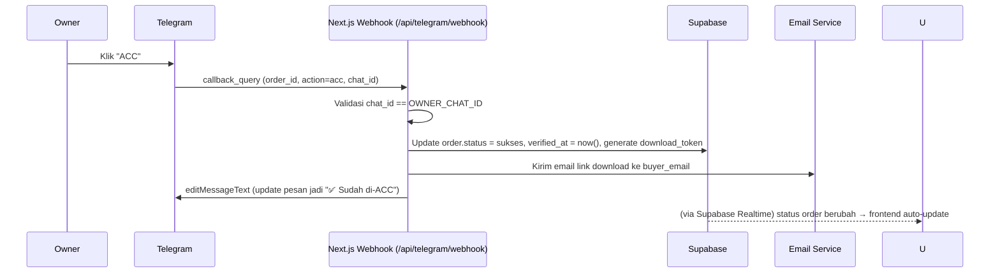
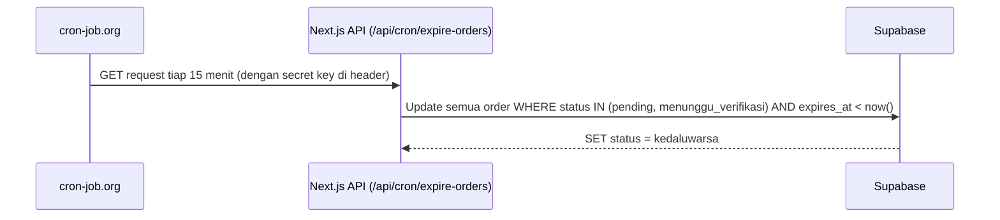

# Technical Design Document (TDD)
## Platform Bundle Prompt AI & Desain Instan untuk UMKM

**Versi:** 1.0
**Status:** Draft
**Referensi:** PRD v1.0 (prd.md)
**Tanggal:** 18 September 2026

---

## 1. Ringkasan Arsitektur

Sistem dibangun full serverless agar bisa berjalan tanpa biaya server tetap, cocok untuk fase validasi MVP.



**Komponen utama:**
| Layer | Teknologi | Alasan |
|---|---|---|
| Frontend + API | Next.js (App Router), deploy di Vercel | Serverless, gratis, sudah dikuasai |
| Database | Supabase (Postgres) | Gratis, REST API otomatis, realtime built-in |
| Storage file | Supabase Storage | Terintegrasi langsung dengan DB, gratis quota awal |
| Notifikasi & approval | Telegram Bot API | Gratis, mendukung inline button & webhook |
| Auto-expire order | cron-job.org → hit API route | Tidak butuh worker/server standby |
| Realtime status update | Supabase Realtime (channel `orders`) | Push otomatis ke frontend saat status berubah |

---

## 2. Skema Database

### 2.1 Tabel `bundles`
| Kolom | Tipe | Keterangan |
|---|---|---|
| id | uuid (PK) | |
| name | text | Nama bundle, mis. "Paket Promo Ramadhan" |
| slug | text (unique) | Untuk URL detail bundle |
| description | text | |
| price | integer | Harga dalam Rupiah (satuan penuh, bukan sen) |
| preview_images | text[] | Array URL gambar preview (Supabase Storage) |
| file_url | text | Path file ZIP hasil (privat, hanya diakses setelah order sukses) |
| is_active | boolean | Tampil/tidak di katalog |
| created_at | timestamptz | |
| updated_at | timestamptz | |

### 2.2 Tabel `orders`
| Kolom | Tipe | Keterangan |
|---|---|---|
| id | uuid (PK) | |
| order_code | text (unique) | Kode pendek untuk dicocokkan manual, mis. `ORD-8841` |
| bundle_id | uuid (FK → bundles.id) | |
| buyer_name | text | Nama pembeli |
| buyer_email | text | Untuk kirim link download |
| buyer_phone | text (nullable) | Opsional, nomor WA |
| sender_name | text (nullable) | Nama pengirim transfer, diisi user sebelum klik "Cek Pembayaran" |
| base_price | integer | Harga asli bundle |
| unique_code | integer | Kode unik 3 digit (mis. 017) ditambahkan ke nominal |
| total_amount | integer | `base_price + unique_code`, nominal yang harus dibayar & muncul di QRIS |
| status | text (enum) | `pending`, `menunggu_verifikasi`, `sukses`, `ditolak`, `kedaluwarsa` |
| telegram_message_id | text (nullable) | ID pesan Telegram terkait, untuk update pesan setelah ACC/Tolak |
| download_token | text (nullable) | Token unik untuk link download setelah sukses |
| download_expires_at | timestamptz (nullable) | Masa berlaku link download |
| created_at | timestamptz | |
| verified_at | timestamptz (nullable) | Waktu owner klik ACC |
| expires_at | timestamptz | `created_at + 24 jam`, dipakai job auto-expire |

### 2.3 Tabel `admin_settings` (opsional, untuk fleksibilitas)
| Kolom | Tipe | Keterangan |
|---|---|---|
| key | text (PK) | mis. `telegram_chat_id`, `qris_image_url` |
| value | text | |

> Alternatif: simpan langsung sebagai environment variable kalau tidak butuh diubah dari admin panel.

---

## 3. Alur Utama (Sequence)

### 3.1 Checkout & Pembuatan Order


### 3.2 Klik "Cek Pembayaran" → Notifikasi Telegram


### 3.3 Approval Owner → Update Status


### 3.4 Auto-Expire Order


---

## 4. Struktur API Route (Next.js App Router)

```
/app
  /api
    /orders
      route.ts              → POST: buat order baru
      /[id]/check-payment
        route.ts             → POST: update status → menunggu_verifikasi, trigger notif Telegram
      /[id]/status
        route.ts             → GET: cek status order (fallback polling kalau realtime gagal)
    /telegram
      /webhook
        route.ts             → POST: terima callback_query dari Telegram (ACC/Tolak)
    /cron
      /expire-orders
        route.ts             → GET: dipanggil cron-job.org, expire order lama
    /download
      /[token]
        route.ts             → GET: validasi token, redirect ke file di Supabase Storage
  /bundles
    page.tsx                 → Katalog (SSG/ISR)
    /[slug]
      page.tsx                → Detail bundle
  /checkout
    /[orderId]
      page.tsx                → Halaman QRIS + tombol "Cek Pembayaran" + status realtime
```

---

## 5. Detail Implementasi Penting

### 5.1 Generate Kode Unik Nominal
```ts
// Ambil 3 digit terakhir dari counter/random, hindari duplikat nominal aktif
function generateUniqueCode(basePrice: number): { uniqueCode: number; total: number } {
  const uniqueCode = Math.floor(Math.random() * 900) + 100; // 100–999
  return { uniqueCode, total: basePrice + uniqueCode };
}
```
Cek dulu apakah kombinasi `total_amount` sudah dipakai order lain yang masih `pending`/`menunggu_verifikasi` — kalau bentrok, generate ulang.

### 5.2 Format Notifikasi Telegram
```
🔔 Order Baru Menunggu Verifikasi
Order: ORD-8841
Bundle: Paket Promo Ramadhan
Nama Pengirim: Siti Rahma
Nominal: Rp 49.017
[✅ ACC]  [❌ Tolak]
```
Inline keyboard callback_data: `acc:ORD-8841` / `tolak:ORD-8841`

### 5.3 Validasi Keamanan Webhook Telegram
- Simpan `TELEGRAM_BOT_TOKEN` dan `OWNER_CHAT_ID` sebagai environment variable.
- Di endpoint webhook, tolak request jika `chat_id` pengirim callback ≠ `OWNER_CHAT_ID`.
- Gunakan secret path untuk webhook URL (mis. `/api/telegram/webhook/{random-secret}`) sebagai lapisan tambahan.

### 5.4 Keamanan Endpoint Cron
- Endpoint `/api/cron/expire-orders` divalidasi via header `Authorization: Bearer <CRON_SECRET>`.
- Set `CRON_SECRET` di environment variable, dicocokkan di server sebelum eksekusi.

### 5.5 Link Download Aman
- `download_token` di-generate pakai `crypto.randomUUID()` saat status jadi `sukses`.
- `download_expires_at` = `verified_at + 48 jam` (durasi bisa disesuaikan).
- Endpoint `/api/download/[token]` cek token valid & belum expired sebelum redirect ke file Supabase Storage (signed URL, bukan public URL permanen).

### 5.6 Realtime Status di Frontend
```ts
// Subscribe ke perubahan row order tertentu
supabase
  .channel(`order-${orderId}`)
  .on('postgres_changes', {
    event: 'UPDATE',
    schema: 'public',
    table: 'orders',
    filter: `id=eq.${orderId}`
  }, (payload) => {
    setOrderStatus(payload.new.status);
  })
  .subscribe();
```
Fallback: kalau realtime gagal connect, frontend polling `GET /api/orders/[id]/status` tiap 5 detik.

---

## 6. Environment Variables

| Key | Keterangan |
|---|---|
| `NEXT_PUBLIC_SUPABASE_URL` | URL project Supabase |
| `NEXT_PUBLIC_SUPABASE_ANON_KEY` | Public key untuk client |
| `SUPABASE_SERVICE_ROLE_KEY` | Untuk operasi server-side (update status, generate signed URL) |
| `TELEGRAM_BOT_TOKEN` | Token bot dari BotFather |
| `TELEGRAM_OWNER_CHAT_ID` | Chat ID owner, satu-satunya yang boleh ACC |
| `CRON_SECRET` | Validasi request dari cron-job.org |
| `QRIS_IMAGE_URL` | URL gambar QRIS statis GoPay Merchant |

---

## 7. Deployment

1. **Repo**: satu repo Next.js, push ke Github.
2. **Vercel**: connect repo → auto-deploy tiap push ke `main`.
3. **Supabase**: buat project, jalankan migration SQL untuk tabel `bundles` & `orders`, aktifkan Realtime untuk tabel `orders`.
4. **Telegram Bot**: buat via BotFather, set webhook URL ke `https://<domain>/api/telegram/webhook/<secret>` menggunakan `setWebhook` API.
5. **cron-job.org**: daftarkan job GET ke `/api/cron/expire-orders` dengan header `Authorization`, interval 15 menit.

---

## 8. Open Items untuk Development

- Perlu keputusan: apakah `unique_code` di-generate random atau sequential counter (random lebih simpel, sequential lebih mudah diprediksi habisnya slot 100–999 kalau order ramai bersamaan).
- Perlu template email delivery (isi & desain email saat status sukses).
- Perlu desain state UI: `pending`, `menunggu_verifikasi`, `sukses`, `ditolak`, `kedaluwarsa` — masing-masing tampilan berbeda di halaman checkout.
